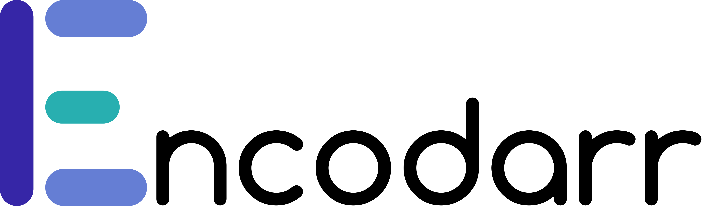

<p align="center">
  
</p>

[](https://github.com/BrenekH/encodarr/blob/master/LICENSE)


[](https://github.com/BrenekH/encodarr/actions/workflows/controller.yaml)
[](https://github.com/BrenekH/encodarr/actions/workflows/runner.yaml)

## What is Encodarr?

Encodarr is a self-hosted web application that encodes video files to a target format using distributed computing.

## Why use Encodarr?
<!-- TODO: Why use Encodarr? (other than easy to setup) -->

### Easy to Setup

Encodarr bypasses the need to share media across the network by instead transmitting the file to be operated on to the Runners.
This means that Encodarr is much easier to setup than other solutions.

## Dependencies

The container images come with the dependencies installed, so if you go that route, all you need is [Docker](https://docs.docker.com/get-docker/).

If you are not using containers, you will need [mediainfo](https://mediaarea.net/en/MediaInfo/Download) and [FFmpeg](https://ffmpeg.org/download.html) in the [PATH](https://en.wikipedia.org/wiki/PATH_(variable)) variable.

## Installing

Container images are available from Docker Hub([Controller](https://hub.docker.com/r/brenekh/encodarr-controller), [Runner](https://hub.docker.com/repository/docker/brenekh/encodarr-runner)) and the GitHub Container Registry([Controller](https://github.com/users/BrenekH/packages/container/package/encodarr-controller), [Runner](https://github.com/users/BrenekH/packages/container/package/encodarr-runner)).

Pre-built executables are available via the [Releases](https://github.com/BrenekH/encodarr/releases/latest) page.

## Usage

### Docker/Docker Compose

The latest Controller version can be run using the following `docker run` command:

```bash
docker run -d \
  --name Encodarr-Controller \
  -e TZ=Europe/London \
  -v <path to data>:/config:rw \
  -v <path to media>:/media:rw \
  -p 8123:8123 \
  --restart unless-stopped \
  --user 1000:1000 \
  brenekh/encodarr-controller:latest
```

or if you prefer Docker Compose:

```yml
version: "2.2"
services:
  encodarr-controller:
    image: brenekh/encodarr-controller:latest
    container_name: Encodarr-Controller
    environment:
      - TZ=Europe/London
    volumes:
      - <path to controller data>:/config:rw
      - <path to media>:/media:rw
    ports:
      - 8123:8123
    restart: unless-stopped
    user: "1000:1000"
```

The latest Runner version is similar.

Docker run:

```bash
docker run -d \
  --name Encodarr-Runner \
  -v <path to runner data>:/config:rw \
  -e "ENCODARR_RUNNER_NAME=Runner 1" \
  -e ENCODARR_RUNNER_CONTROLLER_IP=<Controller IP> \
  -e ENCODARR_RUNNER_CONTROLLER_PORT=8123 \
  --restart unless-stopped \
  brenekh/encodarr-runner:latest
```

Docker Compose:

```yml
version: "2.2"
services:
  encodarr-runner:
    image: brenekh/encodarr-runner:latest
    container_name: Encodarr-Runner
    volumes:
      - <path to runner data>:/config:rw
    environment:
      - ENCODARR_RUNNER_NAME=Runner 1
      - ENCODARR_RUNNER_CONTROLLER_IP=<Controller IP>
      - ENCODARR_RUNNER_CONTROLLER_PORT=8123
    restart: unless-stopped
```

The Controller `path to media` and the corresponding mount inside the container can be anything you want and you can have as many as you want.
For example, `/mnt/disk/tv:/tv:rw` and `/mnt/disk/movies:/movies:rw`.

In addition, the paths to data that are mounted to `/config` in the container should be separate folders, ideally with full paths\(`/home/user/docker` instead of `~/docker`\).

### Startup Configuration

Startup values configured either through environment variables, or command line arguments.
All of the command line variants expect a value after a space (`--port 8123`).

#### Controller

`ENCODARR_PORT`, `--port` sets the port for the HTTP web server.
For containers, it is recommended to modify the external port (`8124:8123`) instead of setting this value.
(default: `8123`)

`ENCODARR_CONFIG_DIR`, `--config-dir` sets the directory that the configuration files are saved to.
This includes the log file.
In a container, this is pre-set to `/config`.
(default: `<platform user config directory>/encodarr/controller/config`)

#### Runner

`ENCODARR_CONFIG_DIR`, `--config-dir` sets the directory that the configuration files are saved to.
This includes the log file.
In a container, this is pre-set to `/config`.
(default: `<platform user config directory>/encodarr/runner-<time of runner startup>/config`)

`ENCODARR_TEMP_DIR`, `--temp-dir` sets the directory that the media files are saved to when they are being worked on.
If you want to protect your flash memory(SSDs and SD Cards), you can set this to be on a hard drive.
(default: `<platform user temp directory>`)

`ENCODARR_LOG_LEVEL`, `--log-level` sets the level of output from the logging system to both the log file and the terminal output.
Possible values are: `trace`, `debug`, `info`, `warn` (or `warning`, they are identical), `error`, `critical`.
(default: `info`)

`ENCODARR_RUNNER_NAME`, `--name` sets the name to be shown in the Web UI when referring to this runner.
(default: `<machine hostname>-<random number>`)

`ENCODARR_RUNNER_CONTROLLER_IP`, `--controller-ip` sets the IP for connecting to the Controller.
(default: `localhost`)

`ENCODARR_RUNNER_CONTROLLER_PORT`, `--controller-port` sets the port for connecting to the Controller.
(default: `8123`)

## Contributing

> I am currently looking for someone to verify the Mac OS binaries.
> They theoretically should just work, but I can't test it because I don't have access to a Mac.
> If you do verify please let me know in the [Discussions](https://github.com/BrenekH/encodarr/discussions) page, but if they don't please open a [new issue](https://github.com/BrenekH/encodarr/issues/new/choose).

If you want to contribute to this project, head over to [CONTRIBUTING.md](CONTRIBUTING.md) to get started.
Do note that the project is going to be rewritten soon to more closely follow clean architecture guidelines, so contributing to the `master` or `development` branches is not recommended at this time.

## Code of Conduct

This project holds all maintainers, contributors, and participants to the standards outlined by the Contributor Covenant, a copy of which can be found in [CODE_OF_CONDUCT.md](CODE_OF_CONDUCT.md).

## Future Plans

* Rewrite Runner from Python to Go (following Clean Architecture guidelines)

* Rewrite Controller to conform to Clean Architecture guidelines

* Instead of configuring with dropdowns and checkboxes, use a plugin system

* Massive frontend overhaul

* Scheduled working times

## Attributions

`controller/mediainfo/mediainfo.go` was modified from [pascoej/go-mediainfo](https://github.com/pascoej/go-mediainfo/blob/509f5adb9998a8fe497be4eed69c73d75161709e/mediainfo.go).
